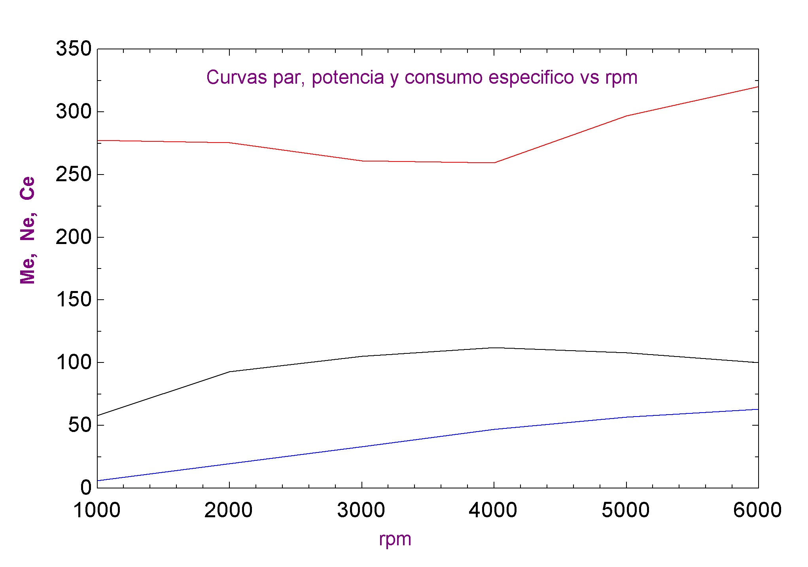
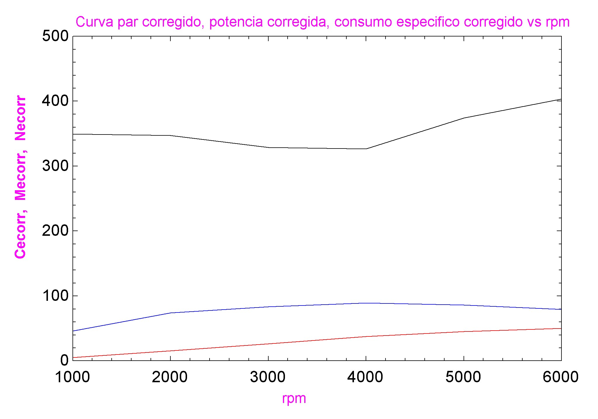
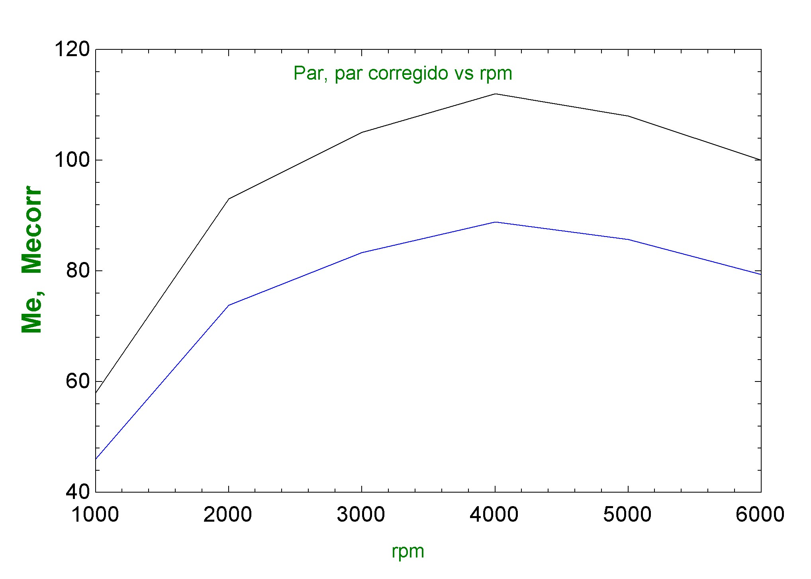
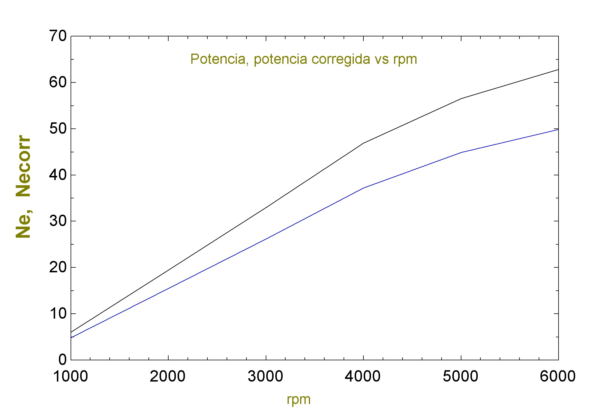
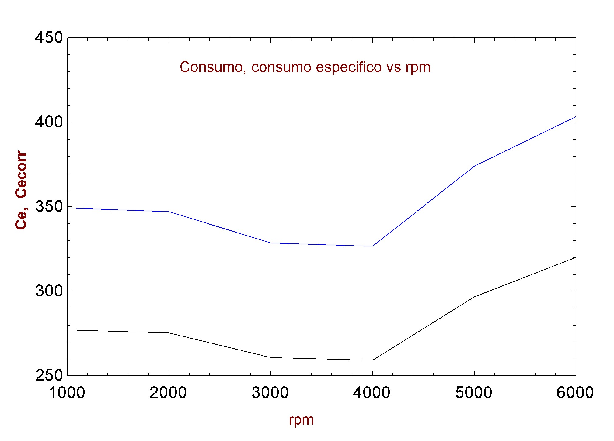

# Práctica Nro. 3: Aplicación del software EES en Motores de Combustión Interna
**Asignatura:** Termodinámica de Máquinas Térmicas (EM6P2A3)  
**Maestría en Ingeniería Automotriz** - Universidad Nacional de Loja  
**Autor:** GRUPAL
**Fecha de Ejecución:** 7 de marzo de 2026

---

## 1. Descripción del Proyecto
Este repositorio contiene el modelado termodinámico y geométrico de un motor de encendido provocado (MEP) desarrollado en el software **Engineering Equation Solver (EES)**. El objetivo principal es el análisis de curvas multiparamétricas y la sensibilidad del desempeño ante variaciones de cilindrada, relación de compresión y condiciones atmosféricas.

## 2. Archivos del Repositorio
*   `Simulacion_Motor.EES`: Archivo fuente original ejecutable en EES Profesional.
*   `Codigo_Fuente.txt`: Copia en texto plano de las ecuaciones implementadas para revisión rápida.
*   `/Resultados`: Carpeta con capturas de las tablas paramétricas y gráficas generadas.

## 3. Parámetros de Diseño del Motor Modelado
*   **Tipo:** 4 tiempos, 4 cilindros.
*   **Geometría:** Diámetro 89.6 mm | Carrera 91 mm.
*   **Relación de Compresión Base:** 10:1.
*   **Potencia Nominal:** 94.57 kW a 4500 rpm.
*   **Combustible:** Gasolina (AFR = 14.5).

## 4. Casos de Estudio Implementados
1.  **Variación de Cilindrada (±25%):** Análisis del impacto del volumen unitario ($V_h$) sobre la potencia y el flujo másico.
2.  **Sensibilidad de la Cámara de Combustión (±15%):** Influencia del volumen muerto ($V_c$) en la relación de compresión recalculada.
3.  **Corrección Atmosférica (Loja):** Modelado del flujo volumétrico de aire según la densidad ambiental (Presión y Temperatura).

## 5. Resultados Gráficos (Simulación EES)

*Figura 1*

*Figura 2*

*Figura 3*

*Figura 4*

*Figura 5*

.jpg)
*Figura 6*

.jpg)
*Figura 7*

.jpg)
*Figura 8*

.jpg)
*Figura 9*

.jpg)
*Figura 10*

.jpg)
*Figura 11*

---
*Documentación generada para la Práctica de Laboratorio Nro. 3 - 2026.*
